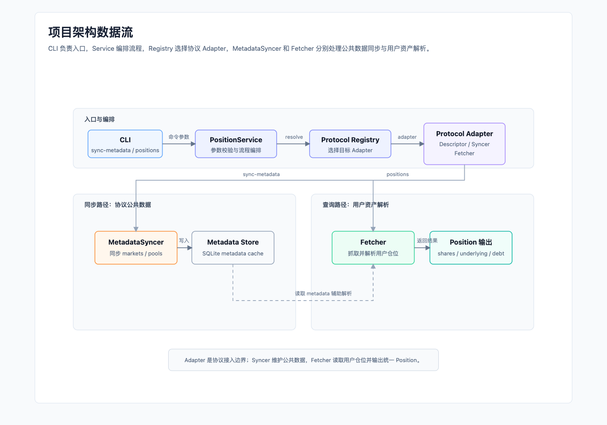

# DeFi Position Reader

DeFi Position Reader 是一个用 Go 编写的轻量 DeFi 协议资产读取与解析框架。

它关注的不是普通钱包余额，而是用户在 DeFi 协议里的仓位：LP 份额、Vault Share、借贷凭证、债务、质押记录、待赎回资产等。项目目标是用一套清晰、可运行、可测试的框架，逐步展示不同协议的链上仓位如何被读取，并尽量穿透到底层 Token。

> 当前项目处于框架阶段，内置 `demo` 协议用于离线演示 metadata sync、cache 和 position fetch 闭环；`aave-v3` 支持 Lending 仓位和 ERC-4626 StataToken / static aToken Yield 仓位读取；`compound-v3` 支持 Compound III / Comet 的 base asset yield、collateralized lending 和 reward 仓位读取。

## 项目定位

- 面向 EVM 多链，默认包含 Ethereum、Arbitrum One、Base。
- 每个协议通过独立 Adapter 接入，协议知识收敛在 `protocols/{protocol-id}` 目录。
- Adapter 内部拆分 `MetadataSyncer` 和 `PositionFetcher`，分别负责协议公共数据同步和用户仓位读取。
- 输出统一收敛到 `Position` 模型，包含 `shares`、`underlying`、`debt` 和协议扩展字段。
- 不做完整商业索引器，不承诺强一致区块快照，不包含价格估值和 HTTP API。
- 测试优先使用 mock / fixture 数据，保证没有 RPC key 也能执行 `go test ./...`。

## 架构概览



核心流程可以概括为：

```text
CLI
  -> Protocol Registry
    -> Protocol Adapter
      -> MetadataSyncer -> Metadata Store
      -> PositionFetcher -> []Position
```

`MetadataSyncer` 维护协议公共数据，例如 market、reserve、pool、token、oracle config；`PositionFetcher` 读取单个用户地址的协议仓位，并结合 metadata 解析成统一的 `Position`。

更详细的架构说明见 [docs/architecture.md](./docs/architecture.md)，框架设计博客见 [docs/blogs/000-defi-asset-position-framework.md](./docs/blogs/000-defi-asset-position-framework.md)。

## 目录结构

```text
cmd/dpr/          CLI 入口
pkg/core/         通用模型：Chain、Token、TokenAmount、Position、MetadataInfo
pkg/adapter/      协议接入接口和 Protocol Registry
pkg/cache/        metadata cache 接口和 SQLite 实现
pkg/chain/        默认 EVM 链配置
pkg/service/      薄编排层，串联 registry、adapter 和 metadata store
protocols/demo/   离线演示协议，展示 metadata sync + position fetch 闭环
docs/architecture.md  架构速查
docs/blogs/       技术博客
docs/diagrams/    文档配图
```

## 快速开始

```bash
go test ./...
make vet
make race
make cover

go run ./cmd/dpr chains
go run ./cmd/dpr protocols
go run ./cmd/dpr sync-metadata -chain ethereum -protocol demo
go run ./cmd/dpr positions -chain ethereum -protocol demo -address 0x0000000000000000000000000000000000000001
go run ./cmd/dpr sync-metadata -chain base -protocol aave-v3
go run ./cmd/dpr positions -chain base -protocol aave-v3 -address 0x...
go run ./cmd/dpr sync-metadata -chain base -protocol compound-v3
go run ./cmd/dpr positions -chain base -protocol compound-v3 -address 0x...
```

也可以直接运行 demo 闭环：

```bash
make run-demo
```

当前 `demo` 协议使用内置 fixture 数据，不需要 RPC key；`aave-v3` 和 `compound-v3` 会读取链上合约，推荐按 `.env.example` 配置自有 RPC URL。未配置时会使用内置 public RPC fallback，但 public RPC 可能限流，稳定性不如自有节点。

`positions` 会先检查 `sync-metadata` 产出的 metadata 是否存在且未过期，默认最大年龄是 `24h`。如果 metadata 缺失或过期，需要先运行：

```bash
go run ./cmd/dpr sync-metadata -chain base -protocol aave-v3
```

### Aave V3 真实链上 Case

下面以 Base 上的 Aave V3 为例，展示从 metadata 同步到用户资产读取的完整链路。地址可以替换成任意 EVM 地址。

```bash
# 1. 可选但推荐：配置自有 RPC，公共 RPC 可能限流或 EOF。
# export BASE_RPC_URL=https://your-base-rpc.example

# 2. 同步 Aave V3 公共数据，包括 markets、reserves 和 yield vaults。
go run ./cmd/dpr sync-metadata \
  -chain base \
  -protocol aave-v3 \
  -format detail \
  -trace

# 3. 查看协议配置和 metadata cache 状态。
go run ./cmd/dpr explain \
  -chain base \
  -protocol aave-v3 \
  -format detail

# 4. 查询用户资产，table 模式适合快速查看结果。
go run ./cmd/dpr positions \
  -chain base \
  -protocol aave-v3 \
  -address 0x448b950a1a58301fa399cc2e47234305d6599bad \
  -format table \
  -trace

# 5. 如需排查底层链路，使用 detail + calls trace。
go run ./cmd/dpr positions \
  -chain base \
  -protocol aave-v3 \
  -address 0x448b950a1a58301fa399cc2e47234305d6599bad \
  -format detail \
  -trace \
  -trace-level calls
```

`sync-metadata -format detail -trace` 会展示 discovery 阶段，例如 reserve / vault 发现、Multicall 子调用数量和写入的 metadata namespace。`positions -format table` 会展示统一后的 `SUPPLY/SHARES`、`UNDERLYING`、`DEBT` 和 `HEALTH`；`positions -format detail` 会继续展开 market、reserve、vault 和协议扩展字段。

## 示例输出

`positions` 命令会输出统一的 Position 结果。下面是 demo 协议中的 LP 仓位精简示例，展示了 share token 到 underlying token 的解析关系；完整输出还会包含 position id、owner、token address、decimals 和 raw amount。

```json
{
  "protocol": "demo",
  "type": "liquidity",
  "displayName": "Demo WETH / USDC LP",
  "shares": [
    { "token": { "symbol": "dLP" }, "formatted": "1.5" }
  ],
  "underlying": [
    { "token": { "symbol": "WETH" }, "formatted": "0.42" },
    { "token": { "symbol": "USDC" }, "formatted": "1234.5" }
  ]
}
```

## 当前支持

| 类型 | 状态 |
| --- | --- |
| Chains | Ethereum, Arbitrum One, Base |
| Protocols | `demo` fixture adapter, `aave-v3` Lending + Yield adapter, `compound-v3` Comet Yield + Lending + Reward adapter |
| Cache | SQLite metadata store |
| CLI | `chains`, `protocols`, `sync-metadata`, `positions`, `explain`; `sync-metadata` / `positions` / `explain` 支持 `-format json|table|detail` 和 `-trace` |
| Tests | `go test ./...`；Aave V3 / Compound V3 live smoke tests 通过 `DPR_LIVE_TESTS=1` 显式开启 |

Aave V3 接入流程图见 [docs/diagrams/aave-v3-integration-flow.png](./docs/diagrams/aave-v3-integration-flow.png)，Compound V3 资产模型图见 [docs/diagrams/compound-v3-comet-model.svg](./docs/diagrams/compound-v3-comet-model.svg)，测试计划见 [docs/testing/aave-v3-test-plan.md](./docs/testing/aave-v3-test-plan.md)，CLI 展示与 trace 设计见 [docs/cli-design.md](./docs/cli-design.md)。

## 协议接入路线

后续会按协议逐个接入，并为每个协议补充资产解析文章。候选协议包括：

- Lido：staking / wrapper 类资产，适合展示 stETH、wstETH 与底层 ETH 的关系。
- Aave V3：借贷协议，适合展示 reserve metadata、aToken、debt token、underlying、debt 和 ERC-4626 yield vault。当前已支持 Lending 和 Yield；staked AAVE / Safety Module 暂不作为主线。
- Uniswap V2：经典 LP Token，适合展示池子储备和份额换算。
- Uniswap V3：NFT LP 仓位，适合展示 tick、liquidity 和底层资产估算。
- Compound V3：单一基础资产借贷模型，当前已支持 Ethereum、Arbitrum One、Base 的 Comet yield / lending / reward 仓位。
- Sky：MakerDAO / Sky 生态资产，适合展示稳定币、储蓄和协议特定状态。

建议后续接入顺序是：Lido -> Uniswap V2 -> Uniswap V3 -> Sky。这样可以从简单凭证型资产，逐步过渡到 LP、NFT LP 和更复杂的协议状态。

## 技术博客

- [000 - DeFi 资产读取与解析：框架介绍](./docs/blogs/000-defi-asset-position-framework.md)
- [001 - DeFi 资产读取与解析：Aave V3 协议接入](./docs/blogs/001-aave-v3-protocol-integration.md)
- [002 - DeFi 资产读取与解析：Compound V3 协议接入](./docs/blogs/002-compound-v3-protocol-integration.md)

后续每接入一个真实协议，都会补充对应的协议资产解析文章。

## License

Apache-2.0
